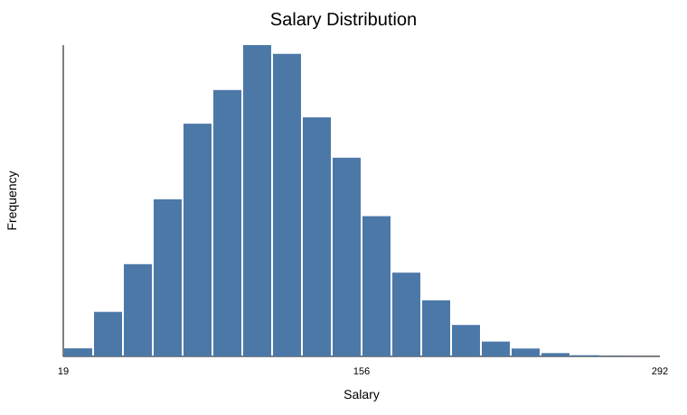
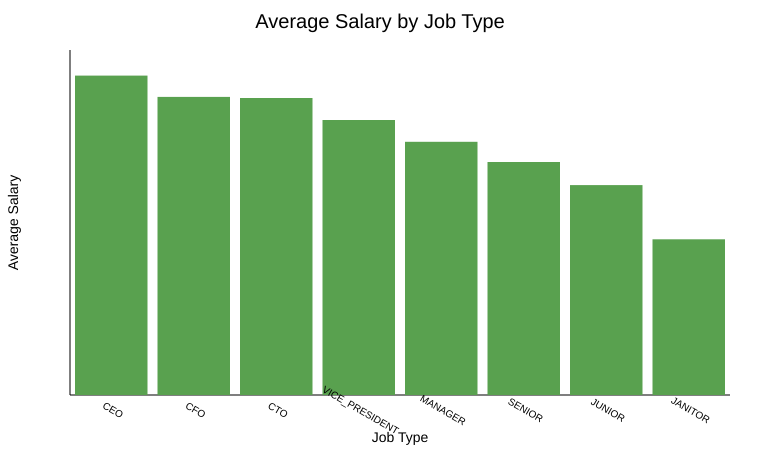
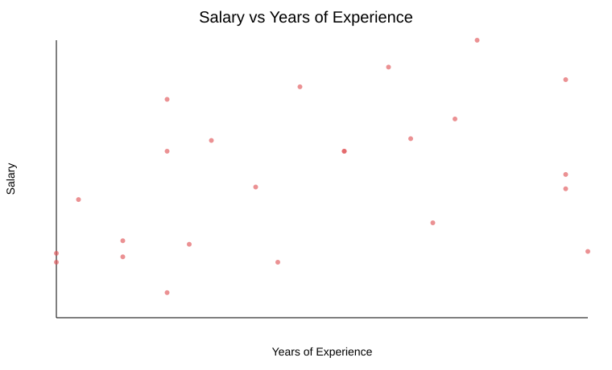
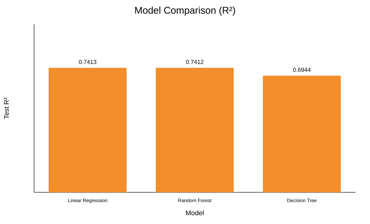
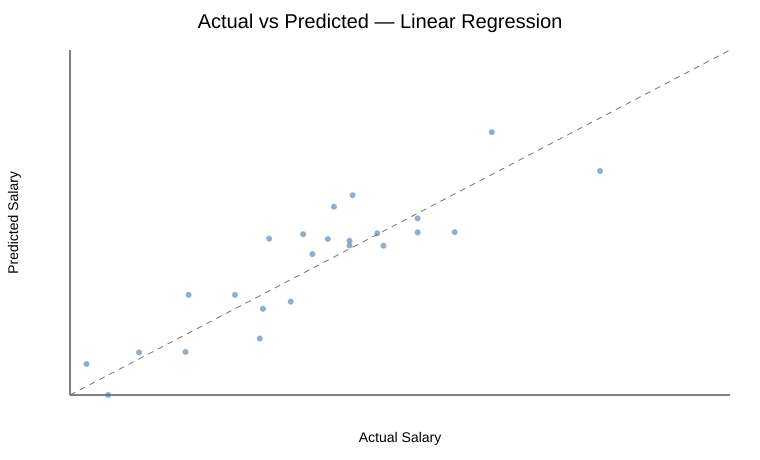
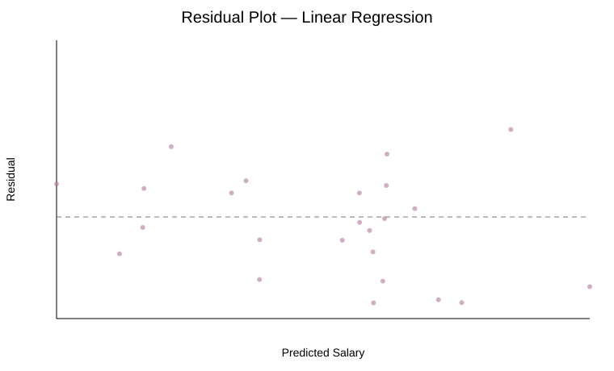

# Employee Salary Prediction

A machine-learning regression project that predicts employee/job salary from job characteristics, education, industry, experience, company ID, and distance from a metropolitan area.

The project intentionally compares only three commonly taught regression models:

- **Linear Regression**
- **Decision Tree Regressor**
- **Random Forest Regressor**

## Key result

On the notebook's saved **100,000-row run** (99,999 rows after removing one zero-salary record), Linear Regression and Random Forest performed almost identically.

| Model | MAE | RMSE | R² | Training time |
|---|---:|---:|---:|---:|
| **Linear Regression** | 15.8859 | **19.7089** | **0.741256** | **0.72 s** |
| Random Forest | **15.8831** | 19.7092 | 0.741247 | 104.09 s |
| Decision Tree | 16.9485 | 21.4182 | 0.694429 | 6.08 s |

**Interpretation:** Linear Regression achieved the marginally highest R², but the difference from Random Forest is only about **0.000009**. Their predictive performance is therefore practically tied. Linear Regression is attractive here because it reached the same level of performance with dramatically lower training time.

> R² = 0.7413 should be described as explaining roughly 74% of the variation in salary on the held-out test set, **not** as “74% accuracy.”

## Dataset

The original training feature file contains **1,000,000 rows and 8 feature columns**. The salary file contains the target column and `jobId`.

After merging:

- Total columns: **9**
- `jobId` is removed before modelling because it is an identifier
- Final predictor count: **7**
- Target: `salary`

### Predictors

| Feature | Description |
|---|---|
| `companyId` | Company identifier |
| `jobType` | Job level/type |
| `degree` | Education level |
| `major` | Academic major |
| `industry` | Industry category |
| `yearsExperience` | Total professional work experience |
| `milesFromMetropolis` | Distance from a metropolitan area |

`yearsExperience` is **total work experience**, not years at the current company.

The data are referenced from the public [Salary-Prediction repository by Jenny Chou](https://github.com/jenny-chou/Salary-Prediction), which provides `SalaryPredictions.zip`.

The raw dataset is not included in this repository because the source repository does not declare a GitHub license.

## Exploratory analysis

### Salary distribution



### Average salary by job type



### Salary vs years of experience



## Modelling workflow

1. Merge the feature and salary tables using `jobId`.
2. Remove invalid salary values (`salary <= 0`).
3. Drop `jobId` from the predictors.
4. Use an 80/20 train-test split with `random_state=42`.
5. One-hot encode categorical variables using a `ColumnTransformer`.
6. Train Linear Regression, Decision Tree, and Random Forest on the same training set.
7. Compare MAE, RMSE, R², and training time on the same held-out test set.

## Model comparison



The main observation is that the more complex Random Forest does not materially improve R² over Linear Regression for this feature set and configuration.

### Actual vs predicted — selected model



### Residual plot



## Repository structure

```text
employee-salary-prediction/
├── README.md
├── LICENSE
├── requirements.txt
├── .gitignore
├── notebooks/
│   └── Employee_Salary_Prediction.ipynb
├── src/
│   └── train_models.py
├── data/
│   └── README.md
├── results/
│   └── model_comparison.csv
├── figures/
│   ├── 01_salary_distribution.svg
│   ├── 02_average_salary_by_job_type.svg
│   ├── 03_salary_vs_experience.svg
│   ├── 04_model_r2_comparison.svg
│   ├── 05_actual_vs_predicted.svg
│   └── 06_residual_plot.svg
└── docs/
    ├── data_dictionary.md
    └── methodology.md
```

## How to run

```bash
git clone https://github.com/shivam991507/employee-salary-prediction.git
cd employee-salary-prediction
pip install -r requirements.txt
```

Download `SalaryPredictions.zip` from the dataset source and place it at:

```text
data/SalaryPredictions.zip
```

Run the notebook:

```bash
jupyter notebook notebooks/Employee_Salary_Prediction.ipynb
```

Or reproduce the modelling table:

```bash
python src/train_models.py
```

To use the complete training dataset:

```bash
python src/train_models.py --nrows 0
```

## Notes and limitations

- The saved notebook results use **100,000 rows**, not the complete one-million-row training table.
- Model performance can change with a different split or hyperparameters.
- A future extension is cross-validation for more robust model comparison.
- `companyId` is anonymized and does not contain real company characteristics.
- Current-company tenure is not available; `yearsExperience` represents total professional experience.
- Salary models should support analysis, not be the sole basis for real-world compensation decisions.

## Tools

Python, pandas, NumPy, Matplotlib and scikit-learn.

## Author

**Shivam Rawat**
